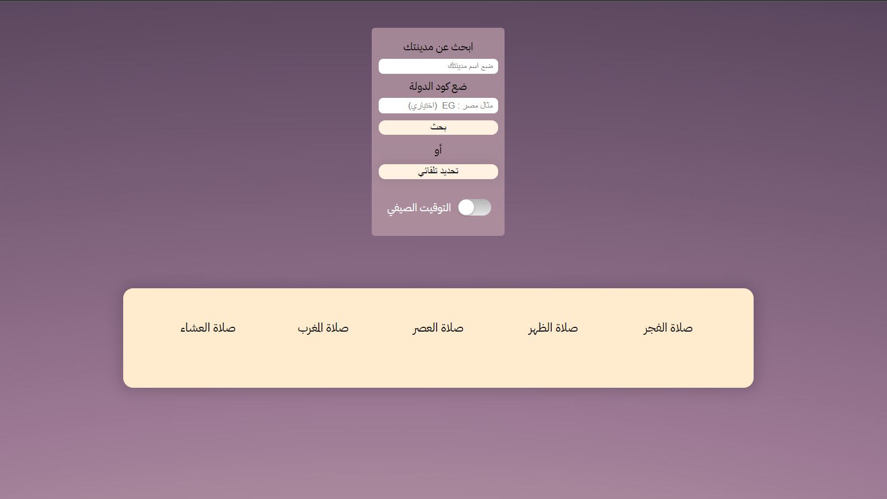

# Simple Azan Website

### website make you allowed to preview the prayes times in your city by simple interface

## Table of contents

- [Overview](#overview)
- [The challenge](#the-challenge)
- [Screenshot](#screenshot)
- [Links](#links)
- [My process](#my-process)
  - [Built with](#built-with)
  - [What I learned](#what-i-learned)
  - [Continued development](#continued-development)
  - [Useful resources](#useful-resources)
- [Author](#author)
- [Acknowledgments](#acknowledgments)

## Overview

### Screenshots

### Links

- Solution URL: [Add solution URL here](https://github.com/Abdoallah-Badr/Simple-Azan-website)
- Live Site URL: [Add live site URL here](https://abdoallah-badr.github.io/Simple-Azan-website/)

### Built with

- Semantic HTML5 markup
- CSS custom properties
- Vanilla Javascript

### What I learned

#### css

- pseudo class before and after and how use them
- making desgin responsive with mobile

#### js

- alot about async javascript and promise functions
- local storage and how get and set from there
- using http methods and learn how recive response or send request
- more and more array and object methods and how analysing data
- working with date by vanilla js and momentjs
- using geocoding api to get location coordinates

### Continued development

- upgrade website styling by adding more animations
- add autoplay azan sound

### Useful resources

- [MDN](https://developer.mozilla.org) - this is my new home i stay there more.
- [PrayTime](http://praytime.info/#home)
- [moment js](https://momentjs.com/)
- [open weather api](https://openweathermap.org/api/geocoding-api)

## Author

- Abdoallah badr

## Author

- Abdoallah badr - [@Abdoallah](https://www.linkedin.com/in/abdoallah-badr-42595919b/)
